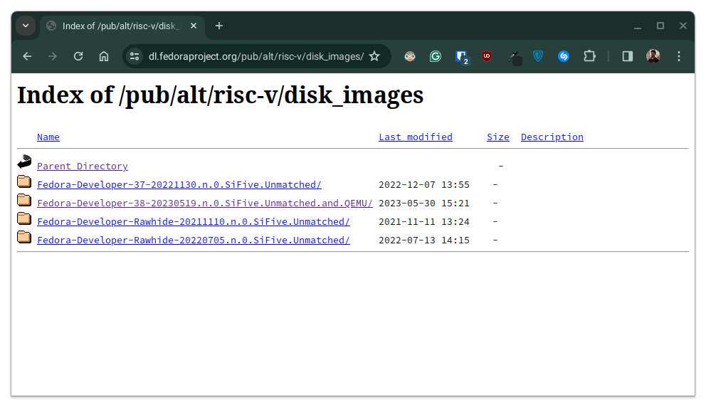
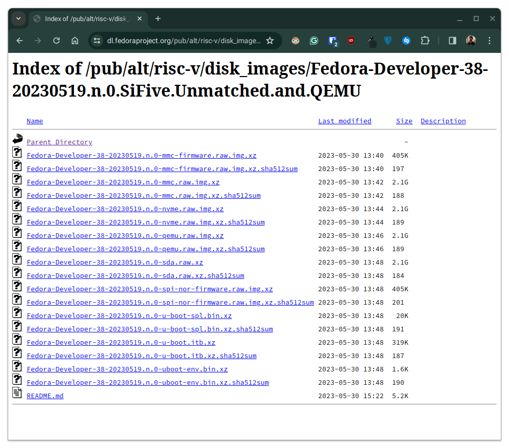

# Booting up Fedora Linux RISCV virtual machine using `virt-install`

1. Visit the following link on a web browser of your choice.
    ```
    https://dl.fedoraproject.org/pub/alt/risc-v/disk_images/
    ```
    

2. Check for the most recent release of Fedora Linux that is compatible with QEMU.
    ```
    https://dl.fedoraproject.org/pub/alt/risc-v/disk_images/Fedora-Developer-38-20230519.n.0.SiFive.Unmatched.and.QEMU/
    ```
    

3. Download and extract the [Uboot image](https://www.rocketboards.org/foswiki/Documentation/SingleImageBoot) archive file for the chosen Fedora Linux release.
    ```
    wget https://dl.fedoraproject.org/pub/alt/risc-v/disk_images/Fedora-Developer-38-20230519.n.0.SiFive.Unmatched.and.QEMU/Fedora-Developer-38-20230519.n.0-u-boot.itb.xz
    ```
    ```
    unxz Fedora-Developer-38-20230519.n.0-u-boot.itb.xz
    ```

4. Download and extract the [secondary program loader image](https://docs.u-boot.org/en/stable/develop/spl.html) archive file for the chosen Fedora Linux release.
    ```
    wget https://dl.fedoraproject.org/pub/alt/risc-v/disk_images/Fedora-Developer-38-20230519.n.0.SiFive.Unmatched.and.QEMU/Fedora-Developer-38-20230519.n.0-u-boot-spl.bin.xz
    ```
    ```
    unxz Fedora-Developer-38-20230519.n.0-u-boot-spl.bin.xz
    ```

5. Download and extract the [virtual machine disk image](https://qemu-project.gitlab.io/qemu/system/images.html) archive file for the chosen Fedora Linux release.
    ```
    wget https://dl.fedoraproject.org/pub/alt/risc-v/disk_images/Fedora-Developer-38-20230519.n.0.SiFive.Unmatched.and.QEMU/Fedora-Developer-38-20230519.n.0-sda.raw.xz
    ```
    ```
    unxz Fedora-Developer-38-20230519.n.0-sda.raw.xz
    ```

6. Create a working directory named `risc` and move all the extracted images into it.
    ```
    mkdir risc
    ```
    ```
    mv -v Fedora-Developer-** risc/
    ```

7. Navigate into the working directory and create a script file named `risc.sh`.
    ```
    cd risc
    ```
    ```
    touch risc-virt.sh
    ```

8. Check the information about the virtual storage device to resize it to the preferred storage size
    ```
    sudo qemu-img info Fedora-Developer-38-20230519.n.0-sda.raw
    ```
    ```
    sudo qemu-img resize Fedora-Developer-38-20230519.n.0-sda.raw -f raw 16G
    ```

9. Edit the newly-created script file with the following contents while making changes wherever necessary.
    ```
    nano risc-virt.sh
    ```
    ```
    sudo \
      virt-install \
        --name fedora-risc-virt \
        --arch riscv64 \
        --os-variant fedora-unknown \
        --memory 8192 \
        --vcpus 8 \
        --qemu-commandline="-machine virt" \
        --qemu-commandline="-device loader,file=Fedora-Developer-38-20230519.n.0-u-boot.itb,addr=0x80200000" \
        --qemu-commandline="-bios Fedora-Developer-38-20230519.n.0-u-boot-spl.bin" \
        --qemu-commandline="-object rng-random,filename=/dev/urandom,id=rng0" \
        --qemu-commandline="-device virtio-rng-device,rng=rng0" \
        --qemu-commandline="-device virtio-blk-device,drive=hd0" \
        --qemu-commandline="-drive file=Fedora-Developer-38-20230519.n.0-sda.raw,format=raw,id=hd0" \
        --network model=virtio,bridge=ntwkbrdg \
        --graphic none \
        --check all=off \
        --import
    ```

10. Make necessary changes to the script file to accommodate for the specific requirements.
    1. Number of CPU cores to be virtualized on the guest machine
    2. Amount of physical memory on the host machine to be allocated to the guest machine
    3. Type of random number generating hardware to be used on the guest machine
    4. Type of virtual storage device to be used on the guest machine
    5. Type of network interface device to be used on the guest machine
    6. Type of block storage device to be used on the guest machine

11. Ensure that the hypervisor service has access to the directories where the image files are kept.
    ```
    sudo getfacl risc
    ```
    ```
    # file: risc
    # owner: username
    # group: username
    user  :: rwx
    group :: r-x
    other :: r-x
    ```

12. Execute the virtual machine using the following command.
    ```
    sh risc-virt.sh
    ```
    ```
    Using fedora-unknown default --disk size=20

    Starting install...
    Allocating 'fedora-risc-virt-01-2.qcow2'
    Creating domain...
    Running text console command: virsh --connect qemu:///system console fedora-risc-virt-01
    Connected to domain 'fedora-risc-virt-01'
    Escape character is ^] (Ctrl + ])
    
    
    U-Boot 2023.04 (May 03 2023 - 00:00:00 +0000)
    
    CPU:   rv64imafdch_zicsr_zifencei_zihintpause_zba_zbb_zbc_zbs_sstc
    Model: riscv-virtio,qemu
    DRAM:  8 GiB
    Core:  34 devices, 14 uclasses, devicetree: board
    Flash: 32 MiB
    Loading Environment from nowhere... OK
    In:    serial@10000000
    Out:   serial@10000000
    Err:   serial@10000000
    Net:   No ethernet found.
    Hit any key to stop autoboot:  0 
    
    Device 0: QEMU VirtIO Block Device
                Type: Hard Disk
                Capacity: 9192.0 MB = 8.9 GB (18825216 x 512)
    ... is now current device
    Scanning virtio 0:1...
    Found /extlinux/extlinux.conf
    Retrieving file: /extlinux/extlinux.conf
    Ignoring unknown command: ui
    Ignoring malformed menu command:  autoboot
    Ignoring malformed menu command:  hidden
    Ignoring unknown command: totaltimeout
    Fedora-Developer-38-20230519.n.0 Boot Options.
    1:	Fedora-Developer-38-20230519.n.0 (6.2.16-300.0.riscv64.fc38.riscv64)
    Enter choice: 1:	Fedora-Developer-38-20230519.n.0 (6.2.16-300.0.riscv64.fc38.riscv64)
    Retrieving file: /vmlinuz-6.2.16-300.0.riscv64.fc38.riscv64
    Retrieving file: /initramfs-6.2.16-300.0.riscv64.fc38.riscv64.img
    append: ro root=UUID=56f56257-a0d4-4865-a531-ade6042a110c rhgb quiet LANG=en_US.UTF-8
    Retrieving file: /dtb-6.2.16-300.0.riscv64.fc38.riscv64/qemu-riscv.dtb
    ** File not found /dtb-6.2.16-300.0.riscv64.fc38.riscv64/qemu-riscv.dtb **
       Uncompressing Kernel Image
    Moving Image from 0x84000000 to 0x80200000, end=82568000
    ## Flattened Device Tree blob at ff74e310
       Booting using the fdt blob at 0xff74e310
    Working FDT set to ff74e310
       Loading Ramdisk to f6cf2000, end fe741d84 ... OK
       Loading Device Tree to 00000000f6cea000, end 00000000f6cf1adf ... OK
    Working FDT set to f6cea000

    Starting kernel ...
    ...
    ```

13. Wait for the virtual machine to boot up and follow the instructions to log in.
    ```
    ...
    [  OK  ] Reached target remote-fs-p…eparation for Remote File Systems.
    [  OK  ] Reached target remote-fs.target - Remote File Systems.
             Starting systemd-user-sess…vice - Permit User Sessions...
             Starting virtqemud.service…0m - Virtualization qemu daemon...
    [  OK  ] Finished systemd-user-sess…ervice - Permit User Sessions.
             Starting gdm.service - GNOME Display Manager...
             Starting plymouth-quit-wai… until boot process finishes up...
    [  OK  ] Started gdm.service - GNOME Display Manager.
    [  OK  ] Started virtqemud.service - Virtualization qemu daemon.
    
    Welcome to the Fedora/RISC-V disk image
    https://fedoraproject.org/wiki/Architectures/RISC-V
    
    Build date: Fri May 19 12:44:23 UTC 2023
    
    Kernel 6.2.16-300.0.riscv64.fc38.riscv64 on an riscv64 (ttyS0)
    
    The root password is 'fedora_rocks!'.
    root password logins are disabled in SSH starting Fedora 31.
    User 'riscv' with password 'fedora_rocks!' in 'wheel' group is provided.
    
    To install new packages use 'dnf install ...'
    
    To upgrade disk image use 'dnf upgrade --best'
    
    If DNS isn’t working, try editing ‘/etc/yum.repos.d/fedora-riscv.repo’.
    
    For updates and latest information read:
    https://fedoraproject.org/wiki/Architectures/RISC-V
    
    Fedora/RISC-V
    -------------
    Koji:               http://fedora.riscv.rocks/koji/
    SCM:                http://fedora.riscv.rocks:3000/
    Distribution rep.:  http://fedora.riscv.rocks/repos-dist/
    Koji internal rep.: http://fedora.riscv.rocks/repos/
    fedora-riscv login:
    ```
    ```
    fedora-riscv login: riscv
    Password:
    ```

14. View the information about the guest machine by executing the following command on the guest machine.
    ```
    hostnamctl
    ```
    ```
         Static hostname: fedora-riscv
               Icon name: computer
              Machine ID: 44ffd9fad8754aecb3ac895b3f986050
                 Boot ID: c111dcfd4e0f4d41ab64ac9b6d800db9
        Operating System: Fedora Linux 38 (Thirty Eight)         
             CPE OS Name: cpe:/o:fedoraproject:fedora:38
          OS Support End: Tue 2024-05-14
    OS Support Remaining: 1month 3w 4d
                  Kernel: Linux 6.2.16-300.0.riscv64.fc38.riscv64
            Architecture: riscv64
    ```

15. Check the information about the CPU by executing the following command on the guest machine.
    ```
    lscpu
    ```
    ```
    Architecture:          riscv64
      Byte Order:          Little Endian
    CPU(s):                8
      On-line CPU(s) list: 0-7
    NUMA:                  
      NUMA node(s):        1
      NUMA node0 CPU(s):   0-7
    ```

16. When done with playing around, turn it off by executing the following command on the guest machine.
    ```
    shutdown
    ```
